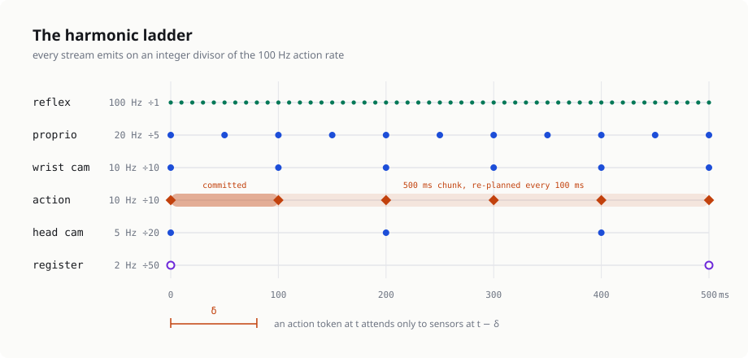
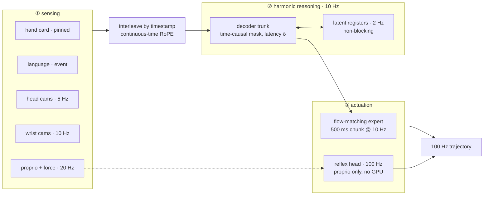

</img>

## Open-Gen

Open source implementation of <a href="https://generalistai.com/blog/gen-1.5">GEN</a>, the embodied foundation model family from Generalist AI, in Pytorch.

GEN is the first model line for which one-shot and few-shot learning of *physical* skills appears to emerge from pretraining alone — show it three seconds of a demonstration, and it does the task, with no gradient updates. This repository reconstructs the architecture that makes that possible: a decoder-only transformer over **continuous time**, where sensing and acting are asynchronous token streams running at different clock rates rather than two models with a handoff.

The trick that carries the whole design is one line of masking. An action token at time `t` may only attend to sensor tokens at `t - δ`, where δ is the inference latency, sampled during training. Latency becomes a *modelled* quantity instead of an engineering problem to route around — which is why no System-1/System-2 split and no inference-time guidance are needed to hit 100 Hz from a 7B model.

Generalist has published capability results and a few architectural names, but no model card and no code. Everything here follows the evidence, with the reasoning written out claim by claim in <a href="./docs/ARCHITECTURE.md">ARCHITECTURE.md</a> — including <a href="./docs/ARCHITECTURE.md#14-part-x--where-this-reconstruction-is-most-likely-wrong">a ranked list of where the reconstruction is most likely wrong</a>. Not affiliated with Generalist AI.

## Install

```bash
$ git clone https://github.com/kyegomez/Open-Gen && cd Open-Gen
$ pip install -e .
```

The model itself needs nothing but Pytorch.

## Usage

```python
import torch
from open_gen.gen_model import GenConfig, GenModel, make_dummy_batch

model = GenModel(GenConfig.og_7b())

batch = make_dummy_batch(model.cfg, batch_size=2)   # swap in your own loader

out = model(batch)
losses = model.compute_loss(batch, out)
losses.total.backward()

chunks = model.sample_actions(batch)                # (2, queries, 50, 92)
```

That's it. Everything below is detail.

## Architecture



Three subsystems, matching the decomposition Generalist uses when reporting per-group fine-tuning weight deltas. Every stream emits on an integer divisor of the 100 Hz action rate — the *harmonic ladder* — so token slots land on a shared grid and the KV cache layout stays static enough to page:

```
            0     10    20    30    40    50    60    70    80    90    100   ms
            │     │     │     │     │     │     │     │     │     │     │
reflex      ●─────●─────●─────●─────●─────●─────●─────●─────●─────●─────●   100 Hz  ÷1
proprio     ●─────────────────────────────●─────────────────────────────●    20 Hz  ÷5
wrist       ●───────────────────────────────────────────────────────────●    10 Hz  ÷10
action      ◆═══════════════════════════════════════════════════════════◆    10 Hz  ÷10
head        ●────────────────────────────────────────────────────────────     5 Hz  ÷20
register    ○────────────────────────────────────────────────────────────     2 Hz  ÷50

            ├── δ ──┤
            an action token at t attends only to sensors at t − δ
            ◆ emits 500 ms of actions; the first 100 ms is committed
```

Nothing waits on anything slower than itself. The trunk thinks at 10 Hz, registers at 2 Hz, and the reflex loop closes on force and proprioception at the full control rate — one model, temporally separated, rather than two models in a hierarchy.

## Physical prompting

A physical prompt is a 3–12 second sensorimotor demonstration spliced into the context. It is deliberately *not* a special input type — no prompt-role embedding, no separator token. The moment the model can tell "prompt" from "history", emergent in-context learning becomes engineered in-context learning.

```python
from open_gen.gen_model import GenRuntime, PhysicalPrompt

demo = make_dummy_batch(model.cfg, batch_size=1)        # a recorded demonstration
prompt = PhysicalPrompt.encode(model, demo, end_time=-13.0)

runtime = GenRuntime(
    model,
    embodiment_features = batch.embodiment_features[:1],
    channel_valid       = batch.channel_valid[:1],
    action_valid        = batch.action_valid[:1],
    delta_s             = 0.08,
)
runtime.reset()
runtime.prime(prompt)                                    # KV pages, pinned
```

Because prompts are encoded once and their pages pinned, swapping one is a page-table edit rather than a forward pass through a 10B encoder. Composition is free — two prompts are simply two spans, and the model invents the bridging motions itself.

## Real-time rollout

Three free-running loops against one paged cache.

```python
for step in range(100):
    t = step * 0.1

    runtime.observe_vision(frames, timestamps, camera_ids, is_wrist, extrinsics)
    runtime.observe_proprio(proprio_features, proprio_timestamps)
    runtime.think(t)                                     # registers, if due

    chunk    = runtime.act(t, proprio_now)               # (1, 50, 92)
    executed = runtime.reflex(chunk, proprio_fast)       # 100 Hz correction
    runtime.commit(executed[:, :10])                     # 100 ms to the robot

    runtime.maintain(t)                                  # evict + decay pages
```

`maintain` evicts unpinned pages older than the 30 s window and mean-pools ageing ones in place. Decay is a cache operation, never a re-encode.

## Cross-embodiment

One model, any robot, ~9,000 end effectors. The embodiment is described *in-band* as a hand card, so an unseen gripper is an unseen input vector rather than an unseen parameter set.

```python
from open_gen.gen_model import EmbodimentSpec

spec = EmbodimentSpec.dummy(cfg.proprio, cfg.vision, cfg.action_space, dof=7)
features = spec.feature_vector()
```

Actions live in a universal space — bimanual SE(3) twist, finger DoF, and a padded joint channel with a validity mask — and a hypernetwork generates the low-rank output adapter from the hand card. A 6-DoF arm and a 16-DoF humanoid write into the same tensor.

## Scale

Presets follow the published ossification phase transition: 1B ossifies under load, 7B internalises. Build any of them under `torch.device("meta")` to count parameters without allocating weights.

```python
import torch
from open_gen.gen_model import count_parameters

with torch.device("meta"):
    model = GenModel(GenConfig.og_7b())

print(count_parameters(model))
```

| preset | params | d_model | layers | heads (kv) | sensing / trunk / actuation |
| ------ | ------ | ------- | ------ | ---------- | --------------------------- |
| `og_0p3b` | 0.38B | 1024 | 16 | 16 (4) | 44 / 46 / 9% |
| `og_1b` | 1.08B | 2048 | 18 | 16 (4) | 19 / 74 / 5% |
| `og_6b` | 6.01B | 4096 | 29 | 32 (8) | 10 / 86 / 4% |
| `og_7b` | 7.25B | 4096 | 36 | 32 (8) | 8 / 88 / 3% |
| `og_11b` | 11.02B | 5120 | 36 | 40 (8) | 6 / 90 / 3% |

Reproducing the 1B-ossifies / 7B-doesn't crossover is the single best correctness check on this implementation — it is the one *falsifiable* published result, unlike the demo videos.

## Evaluation

GEN-0 scores policies with a reverse KL estimated by Monte Carlo over policy samples, which is mode-seeking and therefore punishes the mode-averaging an L2-trained policy exhibits. That protocol is why the action head must be a sampler at all, and it ships here:

```python
kl  = model.reverse_kl(batch, n_samples=16)
mse = model.compute_loss(batch, model(batch)).next_action_mse
```

## Latency sweep

The Harmonic Reasoning test. Success should be roughly flat in δ across the deployment range — if it isn't, the curriculum didn't take.

```python
for delta_ms in (0, 40, 80, 160, 250):
    delta = torch.full((batch.batch_size,), delta_ms / 1000)
    out   = model(batch, delta=delta)
    print(delta_ms, model.compute_loss(batch, out).next_action_mse.item())
```

## Todo

- [x] continuous-time RoPE, time-causal masking with latency offset
- [x] flow-matching action expert with committed-prefix conditioning
- [x] paged KV cache with pinned prompts and in-place temporal decay
- [x] hypernetwork cross-embodiment adapters
- [ ] fused paged-attention kernel (currently a gather + SDPA)
- [ ] μP hyperparameter sweep at 0.3B, transfer to 7B
- [ ] reproduce the ossification crossover on open data
- [ ] RL from experience + multimodal human guidance post-training
- [ ] real dataloader over seekable, time-indexed video shards

## Citations

```bibtex
@article{generalist2026gen15,
    author  = {Generalist Team},
    title   = {GEN-1.5: Embodied Foundation Models are One-Shot Learners},
    journal = {Generalist AI Blog},
    year    = {2026},
    note    = {https://generalistai.com/blog/gen-1.5}
}
```

```bibtex
@article{generalist2026gen1,
    author  = {Generalist Team},
    title   = {GEN-1: Scaling Embodied Foundation Models to Mastery},
    journal = {Generalist AI Blog},
    year    = {2026},
    note    = {https://generalistai.com/blog/gen-1}
}
```

```bibtex
@article{generalist2025gen0,
    author  = {Generalist Team},
    title   = {GEN-0: Embodied Foundation Models That Scale with Physical Interaction},
    journal = {Generalist AI Blog},
    year    = {2025},
    note    = {https://generalistai.com/blog/gen-0}
}
```

```bibtex
@article{Lipman2022FlowMF,
    title   = {Flow Matching for Generative Modeling},
    author  = {Yaron Lipman and Ricky T. Q. Chen and Heli Ben-Hamu and Maximilian Nickel and Matthew Le},
    journal = {ArXiv},
    year    = {2022},
    volume  = {abs/2210.02747}
}
```

```bibtex
@article{Su2021RoFormerET,
    title   = {RoFormer: Enhanced Transformer with Rotary Position Embedding},
    author  = {Jianlin Su and Yu Lu and Shengfeng Pan and Bo Wen and Yunfeng Liu},
    journal = {ArXiv},
    year    = {2021},
    volume  = {abs/2104.09864}
}
```

```bibtex
@article{Chan2022DataDP,
    title   = {Data Distributional Properties Drive Emergent In-Context Learning in Transformers},
    author  = {Stephanie C. Y. Chan and Adam Santoro and Andrew Kyle Lampinen and Jane X. Wang and Aaditya K Singh and Pierre H. Richemond and Jay McClelland and Felix Hill},
    journal = {ArXiv},
    year    = {2022},
    volume  = {abs/2205.05055}
}
```

```bibtex
@inproceedings{Kwon2023EfficientMM,
    title     = {Efficient Memory Management for Large Language Model Serving with PagedAttention},
    author    = {Woosuk Kwon and Zhuohan Li and Siyuan Zhuang and Ying Sheng and Lianmin Zheng and Cody Hao Yu and Joseph E. Gonzalez and Hao Zhang and Ion Stoica},
    booktitle = {SOSP},
    year      = {2023}
}
```

```bibtex
@article{Black2025RealTimeEO,
    title   = {Real-Time Execution of Action Chunking Flow Policies},
    author  = {Kevin Black and Manuel Y. Galliker and Sergey Levine},
    journal = {ArXiv},
    year    = {2025},
    volume  = {abs/2506.07339}
}
```

*For machines, we believe it is only through experiencing the physical world, that all the knowledge on Wikipedia can finally make sense.* — Generalist Team
