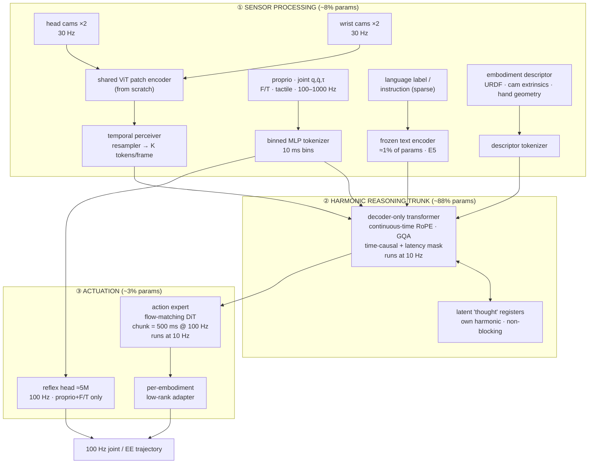

# Open-Gen: A Proposed Architecture for the GEN Embodied Foundation Models

**Status:** design proposal / reverse-engineering study.
**Target:** an open, from-scratch reimplementation of the GEN family (GEN-0 → GEN-1 → GEN-1.5) described by Generalist AI.

> **Epistemic status.** Generalist has published capability results, scaling curves, and a small number of
> architectural *names* ("Harmonic Reasoning", "sensor processing / harmonic reasoning / actuation"), but no
> model card, no layer diagram, and no code. Everything in §2 is quoted or paraphrased from their posts.
> Everything from §4 onward is **our inference**: the minimal architecture we can construct that is consistent
> with *every* published constraint simultaneously. Where a choice is under-determined by the evidence, it is
> marked ⚖️ and alternatives are listed. Do not cite this document as a description of GEN. Cite it as a
> reconstruction.

---

## Table of Contents

1. [Why reconstruct it at all](#1-why-reconstruct-it-at-all)
2. [The evidence base](#2-the-evidence-base)
3. [Constraints the architecture must satisfy](#3-constraints-the-architecture-must-satisfy)
4. [System overview](#4-system-overview)
5. [Part I — Sensor processing: the multi-rate token front-end](#5-part-i--sensor-processing-the-multi-rate-token-front-end)
6. [Part II — Harmonic Reasoning: the continuous-time trunk](#6-part-ii--harmonic-reasoning-the-continuous-time-trunk)
7. [Part III — Actuation: action expert, reflex head, cross-embodiment](#7-part-iii--actuation-action-expert-reflex-head-cross-embodiment)
8. [Part IV — Training objectives and phases](#8-part-iv--training-objectives-and-phases)
9. [Part V — Physical prompting and emergent in-context learning](#9-part-v--physical-prompting-and-emergent-in-context-learning)
10. [Part VI — The inference system](#10-part-vi--the-inference-system)
11. [Part VII — Adaptation: 1–10 gradient steps](#11-part-vii--adaptation-110-gradient-steps)
12. [Part VIII — Scale: sizes, ossification, scaling laws](#12-part-viii--scale-sizes-ossification-scaling-laws)
13. [Part IX — What this architecture deliberately does *not* do](#13-part-ix--what-this-architecture-deliberately-does-not-do)
14. [Part X — Where this reconstruction is most likely wrong](#14-part-x--where-this-reconstruction-is-most-likely-wrong)
15. [Part XI — Open-Gen repository map](#15-part-xi--open-gen-repository-map)
16. [References](#16-references)

---

## 1. Why reconstruct it at all

The interesting claim in the GEN line is not the success rates. It is that a **single autoregressive-style
model trained only on raw physical interaction** — no VLM initialization, no simulator, no meta-learning
objective, no System-1/System-2 split — develops **one-shot in-context learning of closed-loop motor skills**.
That is the robotics analogue of the GPT-2 → GPT-3 transition [1, 2], and if it is real it means the
architecture is doing something specific: it is *sequence modeling over continuous time* rather than
*policy learning over states*.

So the reconstruction question is narrow and answerable:

> What is the smallest set of architectural decisions that (a) lets a 7–11B model emit 100 Hz actions in real
> time, (b) holds 30 s of multi-camera video in context, (c) works across 6-DoF arms to 16+-DoF humanoids and
> ~9,000 end effectors, and (d) makes in-context learning of motor skills *possible to emerge* without being
> trained for?

Everything below is an answer to that question.

---

## 2. The evidence base

Source tags: **[G0]** GEN-0 (Nov 2025) · **[G1]** GEN-1 (Apr 2026) · **[G15]** GEN-1.5 (Aug 2026) ·
**[H]** *Towards Machines with a Thousand Hands* (Jul 2026) · **[B]** *Going Beyond World Models & VLAs* (Apr 2026).

### 2.1 Hard architectural facts

| # | Claim | Source |
|---|---|---|
| E1 | "Large multimodal model that processes video input (30 seconds of memory, alongside other sensor, language, and proprioceptive inputs) and produces **100 Hz action trajectories**." | [G15] |
| E2 | **Harmonic Reasoning**: "a 'harmonic' interplay between **asynchronous, continuous-time streams of sensing and acting tokens**"; models are "trained to simultaneously think and act". | [G0] |
| E3 | Harmonic Reasoning "allows us to scale to very large model sizes **without depending on System1-System2 architectures** or **inference-time guidance**." | [G0] |
| E4 | Architecture decomposes into three named subsystems: **sensor processing**, **harmonic reasoning**, **actuation**. Fine-tuning weight deltas are measured per-subsystem. | [H] |
| E5 | "**Approximately 99% of the parameters are trained from scratch.**" Not a fine-tuned VLM; not just a world model. | [B], [G1] |
| E6 | Phase transition at ~**7B**: 1B ossifies under data load, 6B benefits, 7B+ internalizes pretraining; scaled to **10B+**. | [G0] |
| E7 | Cross-embodiment "by design": tested on **6-DoF, 7-DoF, and 16+-DoF semi-humanoid** robots; **~9,000 end-effector variations**. | [G0], [H] |
| E8 | Fine-tuning weight deltas are **2.5%–11.4%** relative parameter norm for a new end effector; **<0.15%** for a 10-step task adaptation. | [H], [G15] |
| E9 | Metrics are **next-action prediction MSE** *and* **reverse KL** estimated by **Monte-Carlo over policy samples** with a unit-variance Gaussian mixture. | [G0] |
| E10 | "new forms of **paged attention** to enable real-time inference"; custom kernels; petabyte-scale distributed training. | [G1] |
| E11 | Pretraining contains **no robot data** (human wearable/handheld grippers), **no simulation data**, no rendered video. | [G1], [G15] |
| E12 | Pretraining samples **randomly sampled continuous spans**; **no packing infrastructure**; physical prompts introduce **time discontinuities never seen in training**. | [G15] |
| E13 | The model "does not maintain any explicit notion of a subtask" over a long-horizon task; one "single stream of harmonic reasoning". | [G0] |
| E14 | Language labels exist per scene and support **nearest-neighbor language search** over **1,891,392 scenes**; t-SNE over label embeddings. | [G0], [G15] |
| E15 | Post-training stack: SFT, **RL / learning from experience**, **multimodal human guidance**, inference-time techniques. GEN-1 is "a system", not just weights. | [G1] |
| E16 | Adaptation: **1–10 gradient steps** on 1–5 min (~10–50 demos); one-step regime reaches 66.5%; "improves with larger batch sizes and higher learning rates". | [G15] |
| E17 | Physical prompt is **3–12 s** of a single demonstration inserted into the 30 s window; "the remainder holds rolling observations". | [G15] |
| E18 | Prompts compose: two independently recorded demos in context chain into one behavior with **novel bridging motions**. | [G15] |
| E19 | Sim-recorded and **human-hand** demonstrations both work as prompts despite zero sim data and a different embodiment. | [G15] |
| E20 | Data engine ingests **6.85 years of experience per day of training**; 270k h → 500k+ h; +10k h/week. | [G0], [G1] |

### 2.2 Negative facts (things GEN is explicitly *not*)

- Not a VLM with an action head bolted on [B].
- Not "just a world model" [B].
- No architectural changes to promote ICL, **no inner/outer meta-learning loop**, no auxiliary skill-diversity objective [G15].
- No System-1/System-2 split (contrast: Helix [30]), no inference-time guidance for real-time execution (contrast: real-time chunking [24]) [G0].
- No explicit subtask decomposition or planner [G13/E13].

### 2.3 The single most load-bearing sentence

> *"asynchronous, continuous-time streams of sensing and acting tokens"* — [G0]

Every design decision in this document is downstream of taking that sentence literally: **tokens are stamped
with wall-clock time, not sequence index; streams run at different rates; and the acting stream does not block
on the sensing stream.**

---

## 3. Constraints the architecture must satisfy

| Constraint | Derived from | Consequence |
|---|---|---|
| C1. 30 s × N cameras must fit in context at a cost the trunk can afford | E1 | Aggressive, *rate-heterogeneous* visual tokenization + hierarchical temporal decay. ~16–24k tokens for 30 s. |
| C2. 100 Hz action output from a 7–11B trunk | E1, E6 | The trunk **cannot** run at 100 Hz. Requires a rate cascade: slow trunk → fast decoder → reflex loop. |
| C3. Model latency must not stall control | E2, E3 | Time-causal masking with an explicit **latency offset** δ, trained under a jitter distribution. This is the core trick. |
| C4. Time gaps in context must be legal inputs | E12, E17, E18 | Positional encoding must be a function of **continuous timestamp**, not index. Enables prompts, jumps, variable rates, dropped frames — all the same mechanism. |
| C5. Multimodal, mode-seeking action distribution | E9 | A *sampling* action head (flow matching / diffusion), not L2 regression, not discretized bins. |
| C6. One model, 9,000 end effectors, 6–16+ DoF | E7, E8 | Embodiment enters as **data** (a descriptor token set), not as a per-robot head. Only a thin adapter is embodiment-specific. |
| C7. Trained from scratch, ~1% pretrained | E5 | The ~1% is almost certainly a frozen text encoder for scene labels (consistent with E14's label-embedding search). Everything else is randomly initialized. |
| C8. Must not ossify at scale | E6, E20 | μP-style parameterization [39], high token throughput, no small-model shortcuts. Build 7B first, not 1B. |
| C9. Real-time attention over a rolling 30 s window with pinned prompts | E10, E17 | Time-indexed **paged KV cache** with FIFO eviction for observations and **pinned pages** for prompts. |
| C10. 1–10 step adaptation must move <0.15% of weights and still work | E8, E16 | Loss landscape must be flat near the pretrained point → strong regularization from data diversity, and no task-specific parameters that need to be learned from scratch at adapt time. |

---

## 4. System overview



The three boxes correspond one-to-one with the subsystems Generalist names when they decompose fine-tuning
weight deltas [E4]. That decomposition is the strongest structural hint in the entire public record, and it is
why this document is organized the same way.

**Parameter split rationale.** [H] reports that a whisk shifts *sensor-processing* weights much more than a
peeler does, while a power screwdriver produces the largest overall delta (11.4%). For per-subsystem deltas to
be individually meaningful and separately reportable, the three must be distinct parameter groups with the
trunk dominating the count.

The proportions are *reported* by Generalist, never *specified*: nothing published pins them. What does pin
them is the per-component reasoning in §5–§7 — a ViT-L-class tower with perceiver resamplers, a trunk that must
hold 30 s of context, and an action expert small enough to run four flow steps at 10 Hz beside it. Sizing each
component on its own constraints and then measuring gives **≈8% / ≈88% / ≈3%** at the 7B reference point:

| Preset | Total | d_model | Layers | Sensing / Trunk / Actuation |
|---|---|---|---|---|
| OG-0.3B | 0.38B | 1024 | 16 | 44 / 46 / 9% |
| OG-1B | 1.08B | 2048 | 18 | 19 / 74 / 5% |
| OG-6B | 6.01B | 4096 | 29 | 10 / 86 / 4% |
| OG-7B | 7.25B | 4096 | 36 | 8 / 88 / 3% |
| OG-11B | 11.02B | 5120 | 36 | 6 / 90 / 3% |

The trunk's dominance grows with scale, as it must: sensing and actuation are bounded by the physics of what
they process, while reasoning capacity is the thing being scaled. Actuation is small in *parameters* and large
in *importance* — the deltas [H] reports are per-group norms, not per-group sizes, so a 3% subsystem can still
register the largest relative shift when a power screwdriver arrives.

Reproduce any row with `count_parameters(GenModel(GenConfig.og_7b()))` under
`torch.device("meta")`, which allocates no weights.

---

## 5. Part I — Sensor processing: the multi-rate token front-end

### 5.1 The harmonic tick ladder ⚖️

Define a base tick **τ = 10 ms (100 Hz)** — the action rate [E1]. Every stream is emitted at a period that is
an **integer multiple of τ**. This is the second, more literal reading of "harmonic": the streams are
harmonics of a common fundamental, so their token slots always align on a shared grid.

| Stream | Divisor | Rate | Tokens per emission | Tokens / 30 s |
|---|---|---|---|---|
| Action queries | ÷10 | 10 Hz | 1 query → 50-step chunk | 300 |
| Proprio / force / tactile | ÷5 | 20 Hz (100–1000 Hz binned) | 1 | 600 |
| Wrist cameras ×2 | ÷10 | 10 Hz | 16 each | 9,600 |
| Head cameras ×2 | ÷20 | 5 Hz | 32 each | 9,600 |
| Latent thought registers | ÷50 | 2 Hz | 8 | 480 |
| Language / embodiment | event | sparse | ≤64 | ~64 |
| **Total** | | | | **≈20,600** |

Why alignment matters: it makes the KV-cache layout **static and predictable**, which is precisely what lets
you page it (§10.2). A model whose token arrival times were arbitrary reals would need dynamic page
allocation on every step; a harmonic ladder needs none.

### 5.2 Hierarchical temporal decay

20.6k tokens of KV at 11B scale is ~3 GB (§10.2) — affordable but not free, and the oldest 25 s are rarely
worth full resolution. Apply a **decay schedule** over the 30 s window:

```
t ∈ [now-3s,  now  ] : full rate                      (≈2,100 tokens)
t ∈ [now-10s, now-3s] : 2× temporal pooling            (≈2,400 tokens)
t ∈ [now-30s, now-10s]: 4× temporal pooling + 8 tok/frame (≈3,300 tokens)
─────────────────────────────────────────────────────────────
                                              ≈7,800 tokens
```

Pooling is done **in KV space** (mean-pool adjacent pages, keep the time-stamp of the page centroid), so it
costs nothing at encode time and is a pure cache operation. Physical-prompt pages are **exempt** from decay
(§9.2).

### 5.3 Vision tokenizer ⚖️

- Shared **ViT-B/16-class encoder trained from scratch** (E5 forbids a pretrained VLM tower). 224×224 or
  256×256 per camera → 196–256 patches.
- A **temporal perceiver resampler** [16, 17] compresses each frame (plus a short local frame window) to
  K = 32 (head) / 16 (wrist) latents. This is where nearly all of the compression happens, and it is the
  subsystem [H] says the whisk perturbs most.
- **Camera identity + extrinsics** are added as learned embeddings, not inferred. Cross-embodiment demands it:
  a wrist camera on a 6-DoF UR arm and one on a 16-DoF hand see the same world from structurally different poses.
- ⚖️ **Alternative:** a learned discrete video tokenizer (MagViT-v2 style [23]) with a causal 3D CNN. Rejected
  as the default because discrete visual tokens throw away exactly the fine-grained contact/texture signal
  ("thin wire geometry of a whisk", [H]) that this model needs, and because reconstruction-trained tokenizers
  optimize for perceptual quality rather than control-relevance.

### 5.4 Proprioception, force, tactile

Robotics' highest-bandwidth channel and the one teleop datasets lack. [G1] explicitly attributes GEN's speed
partly to handheld data-collection devices giving **force feedback** that teleoperation cannot.

- Raw streams at 100–1000 Hz → **10 ms bins** → per-bin summary vector (mean, min, max, slope per channel).
- Channels are **named and padded** to a fixed schema (e.g., 64 joint slots, 12 F/T slots, 128 tactile slots)
  with a validity mask. A 6-DoF arm and a 16-DoF humanoid produce the same tensor shape; unused slots are
  masked, not zeroed.
- One token per 20 Hz step, produced by a small MLP over the concatenated bins.

### 5.5 Language and the "other 1%"

[E5] says ~99% of parameters are trained from scratch. The natural candidate for the remaining ~1% is a
**frozen sentence/text encoder** — which also explains [E14], where scenes carry language labels whose
*embeddings* support nearest-neighbor search and t-SNE across 1.89M scenes. One encoder serves both purposes:
conditioning the model, and indexing the corpus. A 100–300M frozen text encoder inside a 10B+ model is
~1–3% — the right order of magnitude.

Language enters as a short prefix of ≤64 tokens, and is **frequently dropped** during pretraining (30–50%
dropout) so the model never becomes dependent on instructions. This matters: GEN-1.5's dustpan improvisation
happens "with no language guidance" [G15].

### 5.6 Embodiment descriptor

See §7.3 — it is a token set, not a head.

---

## 6. Part II — Harmonic Reasoning: the continuous-time trunk

This is the part of GEN that has a name but no published definition. Below is the construction we believe is
forced by E2 + E3 + E12 + C3.

### 6.1 Continuous-time positional encoding

Every token carries a **float timestamp t (seconds)**. Positional information is injected via RoPE [15] applied
to *t* rather than to an integer index, with frequencies log-spaced across the dynamic range of the model:

```
θ_k = 2π / (T_min · (T_max/T_min)^(k/(d/2)))     T_min = 10 ms,  T_max = 60 s
RoPE(x, t) = rotate(x, t · θ)
```

Four properties fall out for free, and each maps to a published behavior:

| Property | Published behavior it explains |
|---|---|
| Variable sample rates cost nothing | multi-rate harmonic ladder (E2) |
| Dropped frames / jitter are in-distribution | real-world deployment, network hiccups |
| **A time jump is just a large Δt** | physical prompts "introduce discontinuous jumps in time the model never saw in training" and *work anyway* (E12) |
| Relative time is all that's encoded | 30 s rolling window with no absolute-position drift |

E12 is the strongest single piece of evidence for continuous-time RoPE. Under integer-index positions, splicing
a 12 s demonstration into the context is a distribution shift the model has no basis for handling. Under
continuous-time RoPE it is a 12-second gap — larger than any gap seen in training, but *the same kind of
object*, and rotary encodings extrapolate on gaps far better than on lengths.

### 6.2 The time-causal mask with a latency offset

Standard causal masking says token *i* attends to *j* iff *j ≤ i*. Harmonic Reasoning replaces this with a
**physical-time** condition that includes a per-modality latency:

```
attend(i, j)  ⟺  t_j  ≤  t_i − δ(modality_i, modality_j)
```

where δ is the **compute/transport delay** between producing token *j* and it being usable by token *i*.

- Sensing → sensing: δ = 0 (co-temporal fusion is fine).
- Sensing → action: δ = δ_infer, **sampled during training** from the deployed latency distribution.
- Action → action: δ = 0 (a chunk conditions on committed prior actions).

**This is the mechanism that removes the need for System-1/System-2 and for inference-time guidance [E3].**
π0-style systems handle inference delay *at inference time* — real-time chunking [24] inpaints across the
compute gap; Helix [30] runs a fast policy under a slow VLM. GEN instead makes the delay **part of the
training distribution**, so a 7B trunk that takes 80 ms to think is producing actions it *knows* are 80 ms
stale, and has learned to extrapolate accordingly. Latency becomes a modeled quantity rather than an
engineering problem to route around.

### 6.3 The latency curriculum

```python
# training step, per sample
delta = sample_latency()          # e.g. LogNormal(μ=ln 0.08, σ=0.5), clipped to [10 ms, 250 ms]
mask  = build_time_causal_mask(timestamps, delta)
# the model must predict actions at t from sensing available at t - delta
```

Train with δ jittered *within* a sequence, not just across sequences, so the model handles variable inference
time (batch-size changes, thermal throttling, page faults). Also condition the action expert on δ explicitly
(§7.1) — the model should *know* how stale its observations are.

### 6.4 Asynchronous "think and act": latent registers

[E2] says the model is trained "to simultaneously think and act". [E13] says there is no explicit subtask
notion. Both are satisfied by **latent thought registers**: 8 learned register tokens emitted on a slow
harmonic (2 Hz), which:

1. attend to the full context and to previous registers,
2. are attended *by* action tokens, but
3. **never block them** — an action token at time *t* attends to the most recently *completed* register, whose
   timestamp may be up to 500 ms old.

That is the whole of "asynchronous streams": the slow reasoning stream and the fast acting stream advance
independently on the same timeline, coupled only through the KV cache. There is no handoff, no distillation,
no two models. It is one transformer whose tokens run at different clock rates.

⚖️ **Alternative:** no registers at all — actions attend directly to sensor tokens, and "thinking" is just
depth. Simpler, and arguably closer to "one single stream". We keep registers because they give the model a
place to carry long-horizon state across a 30 s window without spending it on per-frame visual tokens, and
because they make the 2 Hz "slow" computation separable for on-robot scheduling.

### 6.5 Trunk block

Standard modern decoder, chosen boringly on purpose (novelty budget is spent on time, not on blocks):

- Pre-norm RMSNorm, SwiGLU FFN (8/3·d rounded), GQA (8 KV heads) for KV-cache economy, QK-norm for stability
  at scale, no biases, untied embeddings.
- FlashAttention-style kernels [21]; sliding-window attention on the lowest N/4 layers (3 s window) with full
  30 s attention on the rest — cheap locality where it matters, global reach where it matters.
- ⚖️ **Modality-expert FFNs** (separate FFN weights per stream, shared attention — the "mixture-of-transformers"
  pattern used by π0 [12] and GR00T [33]) are a plausible fit for [H]'s clean per-subsystem weight-delta
  decomposition. We treat this as the leading alternative and make it a config flag (`trunk.modality_experts`).

### 6.6 Model configurations

Sized so that the 7B entry matches the published phase-transition point [E6].

| Name | Params | d_model | Layers | Heads (KV) | FFN | Notes |
|---|---|---|---|---|---|---|
| OG-0.3B | 0.38B | 1024 | 16 | 16 (4) | 2752 | debug / unit tests |
| OG-1B | 1.08B | 2048 | 18 | 16 (4) | 5504 | **expected to ossify** — reproduce the negative result |
| OG-6B | 6.01B | 4096 | 29 | 32 (8) | 11008 | "begins to benefit" |
| OG-7B | 7.25B | 4096 | 36 | 32 (8) | 11008 | **phase transition** |
| OG-11B | 11.02B | 5120 | 36 | 40 (8) | 13824 | GEN-1.5 class |

Totals are whole-model counts (sensing + trunk + actuation + heads) measured from the
`GenConfig` presets, not estimates.

μP parameterization [39] throughout, so LR/init sweep once at 0.3B and transfer. Reproducing the ossification
curve (Figure 1 of [G0]) at 1B vs 7B is the single best sanity check that an Open-Gen implementation is on the
right track — it is a *falsifiable* published result, unlike the demo videos.

---

## 7. Part III — Actuation: action expert, reflex head, cross-embodiment

### 7.1 Action expert (flow matching)

[E9] is decisive here. Generalist evaluates with **reverse KL estimated from policy samples** via a Gaussian
mixture. You only build that estimator if your policy is a **sampler** with a multimodal output distribution,
and you only care about mode-seeking behavior if mode-averaging is a live failure mode — i.e., continuous
multimodal action generation. Discrete action bins (RT-2 [8]) would make reverse KL trivial to compute in
closed form; L2 regression would make it meaningless.

**Design:**

- A ~150–250M-parameter **DiT-style flow-matching head** [18, 19], conditioned on the trunk's latent at time *t*.
- Generates a **chunk of 50 actions = 500 ms at 100 Hz**, emitted at 10 Hz (5× overlap).
- **4 integration steps** at inference (rectified-flow-style straightening [19] during training so few steps suffice).
- Conditioning inputs: trunk latent, current proprio, **δ (the latency offset)**, **the actions already committed
  during the compute window**, and the embodiment descriptor embedding.

That last pair is the trained replacement for inference-time guidance: rather than inpainting across the
compute gap at runtime [24], the head is *trained* to produce a chunk that begins where the already-committed
prefix ends. Continuity is a learned property, not a runtime constraint solve.

- **Chunk blending:** at execution, overlapping chunks are blended with a short raised-cosine crossfade
  (~50 ms) to guarantee C¹ continuity even when successive samples disagree.

### 7.2 The reflex head

[G0] says the architecture is "natively designed to capture **human-level reflexes**". Human reflex arcs are
~30–50 ms; no 7B transformer will hit that. So the model needs a spinal loop:

- **~5M-parameter GRU/MLP** running at the full **100 Hz**, on **proprio + force/torque + tactile only** (no vision).
- Emits a **residual correction** to the current chunk's action: contact-triggered compliance, slip arrest,
  impact damping, joint-limit avoidance.
- Trained jointly, with a magnitude penalty so it stays a correction rather than becoming the policy.
- Runs on the robot's control computer; needs no GPU.

This is what makes the published speed numbers (12 s box fold, "the world becomes less quasi-static") coherent
with a 10 Hz trunk: high-frequency reactivity comes from the reflex loop, and semantic reactivity from the trunk.

### 7.3 Cross-embodiment: the hand card

9,000 end effectors [E7] rules out per-embodiment heads. Instead, an embodiment is **described in-band**:

```yaml
# a "hand card" — tokenized into ≤32 tokens and prepended
kinematics:   {dof: 7, joint_axes: [...], limits: [...], link_lengths: [...]}
end_effector: {type: two_finger, span_mm: 85, max_force_N: 120, geometry: <mesh embedding>}
cameras:      [{name: wrist_l, extrinsic: <SE3>, fov: 62}, ...]
sensing:      {ft: true, tactile: false}
control:      {mode: ee_twist, rate_hz: 100}
```

- **Universal action space:** bimanual SE(3) end-effector twist + gripper/finger DoF, expressed in a
  robot-centric frame, with a **padded joint-space channel** and validity mask. A 6-DoF arm, a 7-DoF arm and a
  16-DoF humanoid all write into the same tensor.
- **Per-embodiment adapter:** a small low-rank output adapter (LoRA-shaped, ~0.5–2% of params) maps the universal
  action to that robot's actuators. This directly matches [E8]'s measured 2.5–11.4% weight deltas for new hands —
  the right magnitude for "adapter plus some sensor-encoder movement", far too small for a retrained head.
- **Zero-shot new hands** work because the descriptor is *input*: an unseen gripper is an unseen input vector,
  not an unseen parameter set. This is the mechanism behind [H]'s claim of adapting to new hands on the fly, and
  it is the same trick HPT [37] and CrossFormer [36] use, applied at 9,000× the embodiment count.

---

## 8. Part IV — Training objectives and phases

### 8.1 Losses

```
L = L_action  +  λ_w · L_world  +  λ_l · L_lang  +  λ_r · L_reflex
```

**L_action — conditional flow matching (primary, λ = 1.0).**
For an action chunk `a` and flow time `s ~ U(0,1)`, `a_s = s·a + (1-s)·ε`:
```
L_action = E ‖ v_θ(a_s, s, z_t, δ, prefix) − (a − ε) ‖²
```
This is the "next action prediction" whose validation error is plotted in every published scaling figure
[G0 Fig 1, G15 Fig 3]. Report it in the same units (MSE ~1e-2 range) so curves are comparable.

**L_world — latent future prediction (λ ≈ 0.1–0.3) ⚖️.**
Predict the *encoder latents* of future sensor tokens (0.5 s / 1 s / 2 s horizons) from current trunk state —
JEPA-style [26], no pixel decoding. Justification: [B] states plainly that GEN combines ideas "from across what
you might call VLAs, world models, and beyond", while insisting it is not *just* a world model. A latent
predictive term is the cheapest way to be both. It also plausibly underwrites the improvisation results: a model
that predicts consequences can notice that a dustpan will work.
*This is the least certain component in this document.* Note that [G15] rules out auxiliary objectives
*encouraging improvisation* (they cite DIAYN [11]); a latent-dynamics term is a different animal, but it is
still an inference, not a fact.

**L_lang — captioning (λ ≈ 0.05).** Next-token prediction of the scene's language label from context. Keeps
semantic structure available and produces the embeddings [E14] needs for corpus search. Deliberately small.

**L_reflex (λ ≈ 0.05).** Reflex head supervised on the residual between the executed action and the chunk, plus
an L2 magnitude penalty.

### 8.2 Sampling policy — do not fix what makes ICL work

[E12] is a warning to implementers: GEN samples **random continuous spans** from the corpus, with **no packing
infrastructure**. The obvious "improvement" — packing multiple episodes per sequence, adding episode-separator
tokens, curating demo→execution pairs — is exactly the intervention that would turn emergent ICL into trained
ICL, and would likely destroy the *generality* of the result even as it improves the benchmark. Open-Gen's
default loader must remain the naive one:

```python
span = sample_uniform_continuous_span(corpus, duration=30.0)   # that's it
```

Keep any packed/curated loader behind a flag, off by default, and report both.

### 8.3 Phases

[G15] Figure 3 shows three labeled pretraining phases over 8+ months of continuous training with
"successive surgical architectural and algorithmic changes". A reproducible three-phase schedule:

| Phase | Content | Notes |
|---|---|---|
| **1 — Sensorimotor bootstrap** | short spans (2–5 s), high vision resolution, δ ≈ 0, world loss on | encoders learn contact/geometry; cheap tokens |
| **2 — Long-context harmonization** | full 30 s spans, temporal decay on, δ curriculum ramps to deployment | this is where ICL should appear; watch for it |
| **3 — High-rate refinement** | mixed rates, aggressive δ jitter, high-speed data upweighted, RL/experience mixed in | the speed results (E: ~3× SOTA) come from here |

"Surgical changes" mid-run (adding cameras, changing token budgets, adding an end-effector class) require
architecture-preserving surgery: net2net-style width/depth growth, new modality embeddings initialized to
zero-contribution, optimizer state carried forward. Design for it from day one — a model that must restart
pretraining to accept a new sensor cannot train for eight months.

### 8.4 Post-training [E15]

1. **SFT** on ~1 h of robot data per task (this is the "1 hour" number in every GEN-1 result).
2. **RL from experience** — on-robot rollouts scored by success; [G0] notes that models with *high* prediction
   error but *low* reverse KL are more distributionally multimodal and better RL starting points, which is a
   concrete, testable pretraining-selection criterion.
3. **Multimodal human guidance** — corrections, interventions, preference signals folded back as supervision.
4. **Alignment** — [G1] devotes a section to it: emergent improvisation is a liability when the user's spec
   includes things the robot must *not* do. Architecturally this argues for a conditioning channel for
   constraints, and for the reflex head to carry hard safety limits that no sampled chunk can override.

---

## 9. Part V — Physical prompting and emergent in-context learning

### 9.1 Why it can emerge

Nothing in §5–§8 is designed for in-context learning, which is the point: [G15] states the capability was not
trained for. What the architecture must do is *not preclude* it. Three enabling properties:

1. **Time-gap tolerance** (§6.1) — a spliced demo is a legal input.
2. **A 30 s window that spans several repetitions** of most short-horizon manipulations — the model routinely
   sees "do X, then do X again" during pretraining, so continuing that pattern is a learned sequence operation
   [14].
3. **Burstiness and Zipfian structure** in physical data — [G15] hypothesizes this explicitly, citing Chan et
   al. [13]. Homes/warehouses/factories generate exactly the skewed, bursty distribution that paper identifies
   as the driver of emergent ICL in transformers.

The implementation consequence is negative rather than positive: **do not add anything that lets the model
distinguish "prompt" from "observation"**. No prompt-role embedding, no separator token, no attention gating.
If the demo is just more history, the model's ordinary sequence-continuation machinery does the work.

### 9.2 Physical prompt mechanics

A physical prompt is a 3–12 s sensorimotor span [E17] — sensor tokens **and** action tokens — encoded once and
inserted into the context:

```
context = [ hand_card | prompt_A (3–12 s) | prompt_B (optional) | rolling observations (→ 30 s total) ]
             pinned KV pages ──────────────┘                       FIFO-evicted pages ─────┘
```

- Prompts are encoded **once**, offline, and their KV pages are **pinned** — no recompute, and swapping a prompt
  is a page-table edit. This is the natural reading of "new forms of paged attention" [E10] and it is exactly
  what the drag-and-drop prompt-engineering UI in [G15] implies: prompt selection at interactive latency
  means the prompt cannot be re-run through a 10B encoder on every change.
- **Timestamps are re-based** so the prompt sits at a plausible negative offset (e.g. −25 s to −13 s).
- **Composition** [E18] is free: two prompts are two spans. The bridging motions the model invents between them
  are ordinary continuation, which is why they can contain regrasps and recoveries present in neither prompt.
- **Sim and human-hand prompts** [E19] work because prompts are consumed through the same sensor front-end as
  everything else; a sim rollout is unusual-looking video with an action track attached, and a human hand is an
  unusual-looking end effector. Nothing in the pipeline asks whether the pixels came from a camera.

### 9.3 Evaluation

Reproduce [G15]'s protocol: 10 short-horizon tasks, success rate under (a) one-shot in-context, (b) 1 gradient
step on 1 min, (c) 10 gradient steps on 5 min. Published targets: **59% ± 10** one-shot, **66.5%** one-step,
**83% ± 9** ten-step. Any Open-Gen checkpoint claiming to reproduce GEN-1.5 should report all three.

---

## 10. Part VI — The inference system

[G1] insists GEN-1 is "a system", not weights. The system is where the real-time claims live.

### 10.1 Three loops

```
   ┌── 100 Hz ── reflex head (CPU/MCU, ~5M params) ──────────► actuators
   │                    ▲ proprio, F/T, tactile
   │
   ├── 10 Hz ── action expert (4 flow steps, ~200M) ──► 500 ms chunk ──► ring buffer
   │                    ▲ trunk latent z (may be up to 100 ms stale)
   │
   └── 10 Hz ── trunk forward over new tokens only (KV-cached)
                        ▲ camera + proprio token stream
        └── 2 Hz ── latent thought registers (piggyback on trunk steps)
```

Every loop is free-running. None waits on a slower one — which is the operational meaning of "asynchronous
streams of sensing and acting tokens" [E2], and the reason no System-1/System-2 split is needed [E3]: the
separation is *temporal*, inside one model, rather than *architectural*, across two.

### 10.2 KV cache and paging

For OG-11B (40 layers, 8 KV heads, head_dim 128, bf16):

```
per token = 40 × 8 × 128 × 2 (K,V) × 2 B = 163,840 B ≈ 160 KB
30 s undecayed (20.6k tok) ≈ 3.2 GB
30 s with temporal decay (7.8k tok) ≈ 1.2 GB
```

Comfortable on an on-robot 48 GB card, and the reason GQA is non-negotiable (MHA would be 5× that).

**Paging scheme** (extending vLLM's PagedAttention [20] with a time axis):
- Pages are **time-indexed** and **stream-tagged** (e.g. 128 tokens ≈ 1 s of one stream).
- Three page classes: **pinned** (hand card, language, physical prompts), **live** (last 3 s, full rate),
  **decayed** (older, pooled in place).
- Eviction is FIFO over live pages only; decay is an in-place pooling operation on a page, not a recompute.
- Prompt swaps are page-table writes → the interactive prompt-engineering UI in [G15] costs milliseconds.

### 10.3 Compute budget

Trunk at 10 Hz with ~700 new tokens/s on an 11B model: `2 × 11e9 × 700 ≈ 15 TFLOP/s` for the FFN/projection
path plus attention over the cached window. Well inside a single modern accelerator at realistic MFU. The
7B/10 Hz configuration leaves enough headroom to run the action expert on the same device.

Practical requirements: CUDA graphs or equivalent for the fixed-shape trunk step (the harmonic ladder makes
shapes static — this is the payoff for §5.1), fused flow-integration kernel for the 4-step head, and pinned
host buffers for the sensor path. Quantize the trunk to fp8/int8 for deployment; keep the action expert and
reflex head in bf16/fp32 (action precision is what the task success rate is made of).

---

## 11. Part VII — Adaptation: 1–10 gradient steps

[E16] is architecturally constraining in a way that is easy to miss. Learning a task in **one** gradient step,
moving **<0.15%** of weights [E8], with hyperparameters "similar to pretraining" and no tuning, requires:

- **No task-specific parameters.** Nothing may be randomly initialized at adaptation time — a fresh head
  cannot be trained in one step. Every capability must already exist and merely be re-weighted. This is the
  strongest argument for the universal action space (§7.3): adaptation never adds parameters.
- **A flat, well-conditioned basin**, which is what enormous data diversity buys. [G15]'s own reading — "fine-tuning
  slightly reconfigures knowledge already present rather than building new representations" — is the task-vector
  picture [25]: adaptation is a short move along a direction the pretrained model already spans.
- **Large batch, high LR** [E16] — consistent with a single step needing a low-variance gradient estimate.
- ⚖️ It is worth testing whether **prompt + gradient** compose: initialize adaptation from the in-context-prompted
  state. [G15] notes ICL sometimes *beats* 1–5 gradient steps on the same data, which suggests the two mechanisms
  are not redundant.

Open-Gen exposes this as `open_gen/adapt/` with an explicit no-new-parameters assertion at entry.

---

## 12. Part VIII — Scale: sizes, ossification, scaling laws

### 12.1 Ossification is the reproducible result

[E6]: 1B ossifies, 6B benefits, 7B+ internalizes. [G0] frames this via Moravec's paradox [29] — sensorimotor
intelligence has a *higher* compute activation threshold than abstract reasoning, and ossification appears at
O(1B) in robotics versus O(10M) in language [28, 32]. For Open-Gen this is the load-bearing experiment:
train 1B and 7B on identical data and show the 1B curve flattening while the 7B curve keeps descending. If that
does not reproduce, the tokenization or the data mixture is wrong, and no amount of demo video will reveal it.

### 12.2 Scaling law forms

Model/compute scaling [3, 4], and the pretraining-data-to-downstream law [G0 Fig 4], of the form:

```
E(D_pretrain) = E_∞ + (D_c / D_pretrain)^α
```

with D measured in **action trajectories** and E the asymptotic post-training next-action error. This is what
lets them answer "how much post-training data can I buy with more pretraining data" — the transfer-scaling
framing of Hernandez et al. [5].

### 12.3 Data engine

Not architecture, but it determines whether any of the above is trainable. The published figures — 270k h →
500k+ h, +10k h/week, 1.89M scenes, dozens of PB, O(10k) cores, **6.85 years of experience absorbed per training
day** [E20] — imply a dataloader reading roughly 2,500× real-time. The binding constraint on an open
reimplementation is not FLOPs; it is throughput and storage. Design the loader first:

- Chunked, seekable, compressed video shards with per-stream time indices (random 30 s span reads must be O(1)).
- Decode on separate worker processes; keep GPUs on math.
- Sensor streams stored separately from video and joined by timestamp at load time (they have different
  compression characteristics and different retention needs).
- ⚖️ Realistic open substitutes for pretraining: Open X-Embodiment, DROID, EgoExo/Ego4D, UMI-collected sets [35].
  All are orders of magnitude smaller than GEN's corpus; expect the ICL result to be out of reach and target the
  scaling-law *shapes* instead.

---

## 13. Part IX — What this architecture deliberately does *not* do

Each of these is a rejection Generalist states or strongly implies, and each is a live temptation for an
implementer.

| Not done | Why | Source |
|---|---|---|
| Initialize from a VLM | ~99% from scratch; vision-language pretraining is "a crutch while we don't have enough robotics data" | [B], [G1] |
| System-1 / System-2 split | Harmonic Reasoning replaces it; separation is temporal, not architectural | [G0] |
| Inference-time guidance / runtime chunk inpainting | Latency is trained in via δ, not corrected at runtime | [G0] |
| Discretize actions into bins | Reverse-KL-over-samples evaluation implies a continuous multimodal sampler | [G0] |
| Explicit subtask / skill decomposition or a planner | "does not maintain any explicit notion of a subtask" | [G0] |
| Meta-learning (MAML-style inner loop) | ICL emerged without it; adding it would confound the result | [G15], [10] |
| Skill-diversity auxiliary objectives | Improvisation emerged without them | [G15], [11] |
| Train on simulation | Zero sim data in pretraining — and sim prompts still transfer | [G15] |
| Prompt-role embeddings / episode separators | Would convert emergent ICL into engineered ICL | inferred from [E12] |
| Per-embodiment output heads | 9,000 end effectors; embodiment is input, not parameters | [H] |

---

## 14. Part X — Where this reconstruction is most likely wrong

Ranked by (probability wrong × impact if wrong):

1. **The world-model loss (§8.1).** [B] says they combine world-model ideas; it does not say the objective is
   latent future prediction. It could be pixel-space video prediction, an implicit consequence of action
   prediction alone, or a separate model used only for evaluation/data curation.
2. **"Harmonic" as an integer-rate ladder (§5.1).** Defensible and useful, but the word may refer only to the
   qualitative interplay of streams, with no arithmetic relationship intended.
3. **The reflex head (§7.2).** "Human-level reflexes" may describe emergent trunk behavior rather than a
   dedicated fast module. If the trunk can be run fast enough, no separate head is needed — but then the 100 Hz
   claim needs another explanation.
4. **Flow matching specifically (§7.1).** The evidence forces *a continuous multimodal sampler*; diffusion [34],
   consistency models, or an energy-based head all fit the reverse-KL evaluation equally well.
5. **The identity of the ~1% pretrained parameters (§5.5).** A frozen text encoder is the best fit, but it could
   be a vision encoder, or an audio encoder, or simply a rounding statement.
6. **Latent thought registers (§6.4).** May be plain depth. The published "single stream of harmonic reasoning"
   language is arguably evidence *against* an explicit reasoning stream.
7. **Token budgets and camera counts (§5.1).** Nowhere published. These are engineering-plausible, not sourced.

Corrections and evidence that would move any of these are welcome — open an issue with the source.

---

## 15. Part XI — Open-Gen repository map

```
open_gen/
├── config/
│   ├── model/            og_0p3b.yaml  og_1b.yaml  og_6b.yaml  og_7b.yaml  og_11b.yaml
│   ├── embodiment/       ur7e.yaml  bimanual_gripper.yaml  humanoid_16dof.yaml  hands/*.yaml
│   └── train/            phase1.yaml  phase2.yaml  phase3.yaml
├── sensing/
│   ├── vision.py         # ViT-from-scratch + temporal perceiver resampler   §5.3
│   ├── proprio.py        # 10 ms binning, padded channel schema, masks       §5.4
│   ├── language.py       # frozen text encoder (the ~1%)                     §5.5
│   ├── embodiment.py     # hand-card tokenizer                               §7.3
│   └── ladder.py         # harmonic tick scheduler, token interleaving       §5.1
├── trunk/
│   ├── time_rope.py      # continuous-time rotary embeddings                 §6.1
│   ├── masking.py        # time-causal mask with latency offset δ            §6.2
│   ├── registers.py      # asynchronous latent thought registers             §6.4
│   └── transformer.py    # GQA / SwiGLU / QK-norm blocks, μP                 §6.5
├── actuation/
│   ├── action_expert.py  # flow-matching DiT chunk generator                 §7.1
│   ├── reflex.py         # 100 Hz residual reflex head                       §7.2
│   ├── adapters.py       # per-embodiment low-rank output adapters           §7.3
│   └── blending.py       # raised-cosine chunk crossfade                     §7.1
├── train/
│   ├── losses.py         # CFM + latent-world + captioning + reflex          §8.1
│   ├── sampler.py        # naive uniform continuous spans (do not "improve")  §8.2
│   ├── latency.py        # δ curriculum                                      §6.3
│   └── surgery.py        # net2net growth, new-modality insertion            §8.3
├── inference/
│   ├── paged_kv.py       # time-indexed pages, pinned prompts, decay         §10.2
│   ├── runtime.py        # 100/10/2 Hz loop scheduler                        §10.1
│   └── prompt.py         # physical prompt encode / pin / compose            §9.2
├── adapt/
│   └── few_step.py       # 1–10 step TTT, no-new-parameters assertion        §11
├── data/
│   ├── shards.py         # seekable time-indexed video+sensor shards         §12.3
│   └── loader.py
└── eval/
    ├── next_action.py    # MSE + reverse-KL (MC over policy samples)          §8.1 / E9
    ├── ossification.py   # 1B vs 7B reproduction                              §12.1
    └── icl_suite.py      # 10-task one-shot / 1-step / 10-step protocol       §9.3
```

### Build order (each step falsifiable on its own)

1. `sensing/` + `data/` + next-action MSE on a small public corpus — verify token budgets and throughput.
2. `trunk/time_rope.py` + `masking.py` at OG-0.3B — verify time-gap robustness by splicing spans at train time
   *and* at eval time.
3. `actuation/action_expert.py` — verify reverse KL beats an L2 baseline on multimodal demonstrations.
4. `train/latency.py` — verify success rate is flat in δ across 10–250 ms. **This is the Harmonic Reasoning test.**
5. Scale to OG-1B and OG-7B — reproduce the ossification crossover [§12.1].
6. `inference/` — hit 100 Hz on real hardware with a 7B trunk.
7. `eval/icl_suite.py` — measure whether anything resembling one-shot ICL appears. It probably will not at open
   data scale; report the curve anyway, since the shape is the contribution.

---

## 16. References

Primary sources (the documents this reconstruction is derived from):

- **[G15]** Generalist Team. *GEN-1.5: Embodied Foundation Models are One-Shot Learners.* Generalist AI Blog, Aug 2026. https://generalistai.com/blog/gen-1.5
- **[G1]** Generalist Team. *GEN-1: Scaling Embodied Foundation Models to Mastery.* Generalist AI Blog, Apr 2026. https://generalistai.com/blog/gen-1
- **[G0]** Generalist Team. *GEN-0: Embodied Foundation Models That Scale with Physical Interaction.* Generalist AI Blog, Nov 2025. https://generalistai.com/blog/gen-0
- **[B]** P. Florence and the Generalist Team. *Going Beyond World Models & VLAs.* Generalist AI Blog, Apr 2026.
- **[H]** Generalist Team. *Towards Machines with a Thousand Hands.* Generalist AI Blog, Jul 2026.
- Generalist Team. *The Dark Matter of Robotics: Physical Commonsense.* 2026.

Cited literature (arXiv identifiers are best-effort; verify before formal citation):

1. Brown et al. *Language Models are Few-Shot Learners.* 2020. arXiv:2005.14165
2. Radford et al. *Language Models are Unsupervised Multitask Learners.* OpenAI, 2019.
3. Kaplan, McCandlish et al. *Scaling Laws for Neural Language Models.* 2020. arXiv:2001.08361
4. Hoffmann et al. *Training Compute-Optimal Large Language Models (Chinchilla).* 2022. arXiv:2203.15556
5. Hernandez et al. *Scaling Laws for Transfer.* 2021. arXiv:2102.01293
6. Driess et al. *PaLM-E: An Embodied Multimodal Language Model.* 2023. arXiv:2303.03378
7. Tu et al. *Towards Generalist Biomedical AI (Med-PaLM M).* 2023. arXiv:2307.14334
8. Brohan et al. *RT-2: Vision-Language-Action Models.* 2023. arXiv:2307.15818
9. Du et al. *Video Language Planning.* 2023. arXiv:2310.10625
10. Finn et al. *Model-Agnostic Meta-Learning (MAML).* 2017. arXiv:1703.03400
11. Eysenbach et al. *Diversity is All You Need.* 2018. arXiv:1802.06070
12. Black et al. *π0: A Vision-Language-Action Flow Model for General Robot Control.* 2024. arXiv:2410.24164
13. Chan et al. *Data Distributional Properties Drive Emergent In-Context Learning in Transformers.* 2022. arXiv:2205.05055
14. Mirchandani et al. *Large Language Models as General Pattern Machines.* 2023. arXiv:2307.04721
15. Su et al. *RoFormer: Enhanced Transformer with Rotary Position Embedding.* 2021. arXiv:2104.09864
16. Jaegle et al. *Perceiver IO.* 2021. arXiv:2107.14795
17. Alayrac et al. *Flamingo: a Visual Language Model for Few-Shot Learning.* 2022. arXiv:2204.14198
18. Lipman et al. *Flow Matching for Generative Modeling.* 2022. arXiv:2210.02747
19. Liu et al. *Flow Straight and Fast (Rectified Flow).* 2022. arXiv:2209.03003
20. Kwon et al. *Efficient Memory Management for LLM Serving with PagedAttention (vLLM).* 2023. arXiv:2309.06180
21. Dao et al. *FlashAttention.* 2022. arXiv:2205.14135
22. Défossez et al. *Moshi: a speech-text foundation model for real-time dialogue.* 2024. arXiv:2410.00037 — full-duplex asynchronous stream modeling, the closest published analogue to Harmonic Reasoning.
23. Yu et al. *Language Model Beats Diffusion — Tokenizer is Key to Visual Generation (MagViT-v2).* 2023. arXiv:2310.05737
24. Black et al. *Real-Time Execution of Action Chunking Flow Policies.* 2025. arXiv:2506.07339 — the inference-time approach GEN says it does not need.
25. Ilharco et al. *Editing Models with Task Arithmetic.* 2022. arXiv:2212.04089
26. Bardes et al. *Revisiting Feature Prediction for Learning Visual Representations from Video (V-JEPA).* 2024. arXiv:2404.08471
27. Akyürek et al. *The Surprising Effectiveness of Test-Time Training for Abstract Reasoning.* 2024. arXiv:2411.07279
28. Springer et al. *Overtrained Language Models Are Harder to Fine-Tune.* 2025. arXiv:2503.19206
29. Moravec. *Mind Children.* Harvard University Press, 1988.
30. Figure AI. *Helix: A Vision-Language-Action Model for Generalist Humanoid Control.* 2025. (blog)
31. Bommasani et al. *On the Opportunities and Risks of Foundation Models.* 2021. arXiv:2108.07258
32. Beyer, Zhai et al. *Knowledge Distillation: A Good Teacher is Patient and Consistent.* 2021. arXiv:2106.05237
33. NVIDIA. *GR00T N1: An Open Foundation Model for Generalist Humanoid Robots.* 2025. arXiv:2503.14734
34. Chi et al. *Diffusion Policy: Visuomotor Policy Learning via Action Diffusion.* 2023. arXiv:2303.04137
35. Chi et al. *Universal Manipulation Interface (UMI).* 2024. arXiv:2402.10329 — handheld-gripper data collection, the closest public analogue to GEN's non-teleop data engine.
36. Doshi et al. *Scaling Cross-Embodied Learning (CrossFormer).* 2024. arXiv:2408.11812
37. Wang et al. *Scaling Proprioceptive-Visual Learning with Heterogeneous Pre-trained Transformers (HPT).* 2024. arXiv:2409.20537
38. Zhao et al. *Learning Fine-Grained Bimanual Manipulation with Low-Cost Hardware (ACT/ALOHA).* 2023. arXiv:2304.13705
39. Yang et al. *Tensor Programs V: Tuning Large Neural Networks via Zero-Shot Hyperparameter Transfer (μP).* 2022. arXiv:2203.03466
40. Duan et al. *One-Shot Imitation Learning.* 2017. arXiv:1703.07326
41. Fu et al. *In-Context Imitation Learning via Next-Token Prediction (ICRT).* 2024. arXiv:2408.15980
42. Vosylius & Johns. *Instant Policy: In-Context Imitation Learning via Graph Diffusion.* 2024. arXiv:2411.12633
43. Johns. *Coarse-to-Fine Imitation Learning: Robot Manipulation from a Single Demonstration.* 2021. arXiv:2105.06411
44. Octo Model Team. *Octo: An Open-Source Generalist Robot Policy.* 2024. arXiv:2405.12213
45. Kim et al. *OpenVLA: An Open-Source Vision-Language-Action Model.* 2024. arXiv:2406.09246
46. Minka. *Divergence Measures and Message Passing.* MSR-TR, 2005. — the reverse-KL framing used in [G0].
47. Ke et al. *Imitation Learning as f-Divergence Minimization.* 2019. arXiv:1905.12888
48. Ghasemipour et al. *A Divergence Minimization Perspective on Imitation Learning Methods.* 2019. arXiv:1911.02256

---

*Open-Gen is an independent open-source reconstruction. It is not affiliated with, endorsed by, or derived from
any code or model weights belonging to Generalist AI, Inc.*
